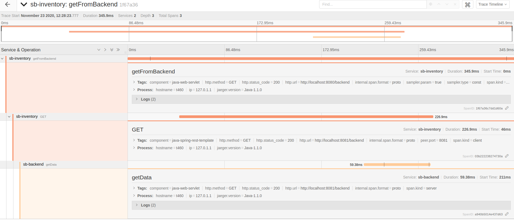
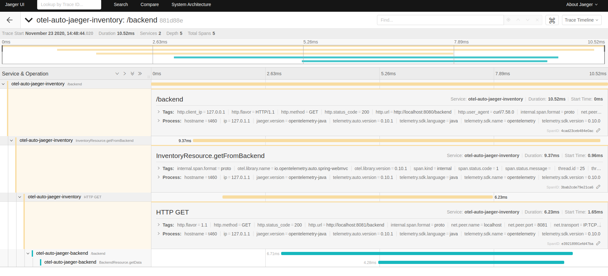
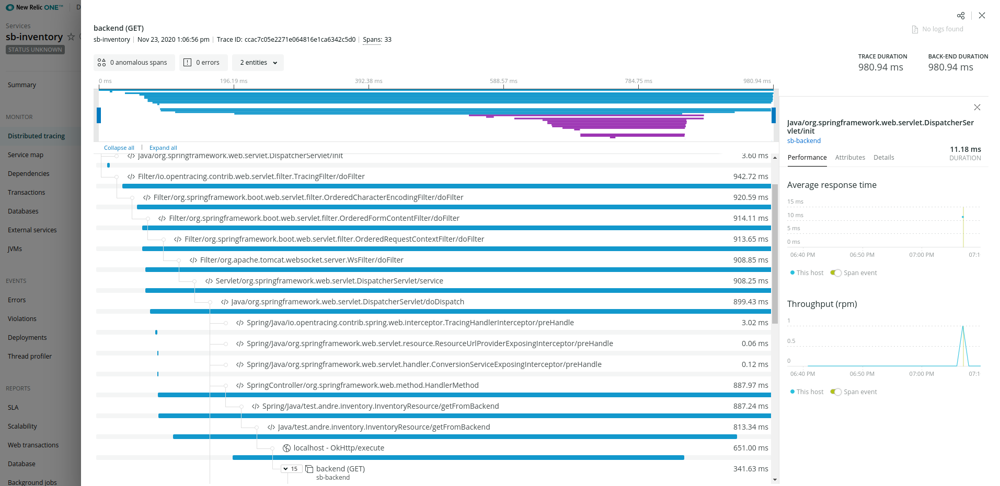

## Open Tracing, Open Telemetry and Application Performance Management


### Setting up the all-in-one Jaeger instance
See https://www.jaegertracing.io/docs/1.21/getting-started/

```
$ docker run -d --name jaeger \
  -e COLLECTOR_ZIPKIN_HTTP_PORT=9411 \
  -p 5775:5775/udp \
  -p 6831:6831/udp \
  -p 6832:6832/udp \
  -p 5778:5778 \
  -p 16686:16686 \
  -p 14268:14268 \
  -p 14250:14250 \
  -p 9411:9411 \
  jaegertracing/all-in-one:1.21
```

### Spring Boot with Open Tracing and Jaeger
- include jaeger-web-starter in both the inventory and the backend project in build.gradle
```
// uncomment the following entry
implementation 'io.opentracing.contrib:opentracing-spring-jaeger-web-starter:3.2.0'
```
- make sure the application.properties contain the proper properties (can also be passed in as runtime argument)
```
~/workspace/sb/backend$ cat src/main/resources/application.properties 
server.port=8081
opentracing.jaeger.service-name=sb-backend
opentracing.jaeger.enable-w3c-propagation=true
~/workspace/sb/backend$ cat ../inventory/src/main/resources/application.properties 
opentracing.jaeger.service-name=sb-inventory
opentracing.jaeger.enable-w3c-propagation=true
```
- clean and build
```
./gradlew clean build
```
- Start the processes
```
~/workspace/sb/backend$ java -jar build/libs/backend-0.0.1-SNAPSHOT.jar 
// on a separate shell, start the inventory service
~/workspace/sb/inventory$ java -jar build/libs/inventory-0.0.1-SNAPSHOT.jar 
```
- Hit the endpoint
```
$ curl localhost:8080/backend
Fetch this from backend : Coming from Backend service
```
- Check on the Jaeger UI (http://localhost:16686/ ), search for sb-inventory service



## Open Telemetry Auto Instrumentation and Jaeger
- Get the opentelemetry java agent from https://github.com/open-telemetry/opentelemetry-java-instrumentation/releases
- Start the process and reference the java agent jar file along with the system properties required

```
java -javaagent:/home/andre/workspace/opentelemetry-0.10.0/opentelemetry-javaagent-all.jar -Dotel.exporter=jaeger -Dotel.exporter.jaeger.service.name=otel-auto-jaeger-backend -jar build/libs/backend-0.0.1-SNAPSHOT.jar 

java -javaagent:/home/andre/workspace/opentelemetry-0.10.0/opentelemetry-javaagent-all.jar -Dotel.exporter=jaeger -Dotel.exporter.jaeger.service.name=otel-auto-jaeger-inventory -jar build/libs/inventory-0.0.1-SNAPSHOT.jar 

```

- Hit the service URI and then check the Jaeger UI



## APM output (New Relic)

- Configure the newrelic.yml and start the java processes referencing the java agent
```
java -javaagent:/home/andre/newrelic/backend/newrelic.jar -jar build/libs/backend-0.0.1-SNAPSHOT.jar 

java -javaagent:/home/andre/newrelic/inventory/newrelic.jar -jar build/libs/inventory-0.0.1-SNAPSHOT.jar 
```

- Hit the service URI and then check the New Relic One UI

